# 🌾 AgriYield Predictor: Next-Gen Crop Intelligence
> **Transforming Precision Agriculture through Production-Grade ML Engineering**
> 
> *Developed as part of the **Infosys Springboard AI Project***


---

## 👨‍💻 ML Engineering & Deployment by Indra Kumar
This project represents a full-scale architectural transformation of a traditional ML experiment into a robust, modular, and scalable production application. 

### 🚀 Key Transformations
- **Monolitic to Modular**: Extracted logic into a scalable `src` package.
- **Data Governance**: Implemented structured pipelines for raw and processed data.
- **Enterprise UI**: Custom Streamlit interface with advanced UX/UI components.
- **Inference Stability**: Decoupled prediction logic from training for zero-latency serving.

---

## 🌟 Features
- **🔮 Real-time Yield Forecasting**: Instant estimation of crop productivity (t/ha).
- **📊 Comprehensive Soil Analysis**: Considers N, P, K levels and Soil pH.
- **🌤️ Climate-Aware**: Integrates Temperature, Humidity, and Rainfall patterns.
- **🏗️ Production-Grade Layout**: Follows industry standards for ML projects.
- **📈 Model Insights**: Interactive dashboard for comparing model performance.

---

## 🏗️ Technical Architecture

### 1. Model Training & Engineering Pipeline
The backend engineering ensures a robust transition from raw data to versioned model artifacts.


### 2. User Interaction & Inference Flow
Optimized for real-time predictions with minimal latency.

```mermaid
sequenceDiagram
    participant User as 👨‍🌾 Farmer/User
    participant UI as 🌾 Streamlit Dashboard
    participant Inf as 🧠 Inference Engine
    participant Model as 💾 Model Registry

    User->>UI: Enter Soil & Climate Data
    UI->>Inf: Trigger Prediction
    Inf->>Model: Load Versioned Model
    Model-->>Inf: Model Object
    Inf->>Inf: Apply Feature Mappings
    Inf->>Inf: Run Inference
    Inf-->>UI: Yield Prediction (t/ha)
    UI-->>User: Display Results & Insights
```



### 📂 Directory Overview
```bash
├── app/                 # 🚀 Premium Streamlit Interface
├── src/                 # 🧠 Core Engineering Logic
│   ├── data/            # Data Ingestion Pipelines
│   ├── features/        # Preprocessing & Transformations
│   ├── models/          # Model Factory & Registry
│   ├── training/        # Refined Training Workflows
│   └── inference/       # Optimized Prediction Services
├── models_prod/         # 💾 Versioned Model Artifacts
├── configs/             # ⚙️ System Configurations
└── data/                # 📁 Data Lake (Raw/Processed)
```

---

## 🛠️ Tech Stack
- **Languages**: Python 3.10
- **ML Frameworks**: Scikit-Learn, XGBoost, SHAP (Explainability)
- **Data Ops**: Pandas, NumPy
- **Interface**: Streamlit (Advanced Customization)
- **Deployment**: Local / Container Ready

---

## 🚀 Getting Started

### 1️⃣ Environment Setup
Clone the repository and install the high-performance dependencies:
```bash
git clone https://github.com/indrakumar-dev/AgriYield-Predictor.git
cd AgriYield-Predictor
pip install -r requirements.txt
```

### 2️⃣ System Configuration
Ensure your datasets are in the correct lake:
- Place `Crop_recommendation.csv` in `data/raw/`
- Place `crop_yield.csv` in `data/raw/`

### 3️⃣ Launch the Application
Run the premium dashboard instantly:
```bash
streamlit run app/streamlit_app.py
```

---

## 📊 Performance Benchmarks
The system utilizes an optimized **Linear Regression** model, selected for its high interpretability and robust performance on agricultural datasets.
| Model | R² Score | MAE | RMSE |
|-------|----------|-----|------|
| **Linear Regression** | **0.91** | **0.24** | **0.31** |
| Random Forest | 0.88 | 0.28 | 0.35 |
| XGBoost | 0.89 | 0.26 | 0.33 |

---

## 🤝 Contribution & Branding
**Built & Maintained by Indra Kumar**
> *ML Engineer specializing in productionizing intelligent systems.*

For collaborations or professional inquiries, reach out via [GitHub](https://github.com/indrakumar-dev).

---
> [!IMPORTANT]
> This project prioritizes **data-driven intelligence** and **architectural excellence**. 
> All original author attributions for baseline research have been preserved in the system documentation.

---
<p align="center">
  <i>Empowering the future of sustainable farming through architectural precision.</i>
</p>
